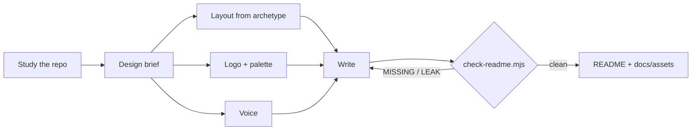

<div align="center">


# readmelyzer

**Every project deserves its own front door.**
An agent skill that studies your repo, then designs a README for it: its own logo, colors, voice and examples.

[](#install)
[](#install)
[](#install)
[](#verify)
[](LICENSE)

</div>

---

## At a glance

| You say | readmelyzer does | You get |
|---|---|---|
| *"Write a README"* or *"readmelyzer"* | Studies the repo, writes a 6-line design brief, picks a layout for this kind of project, draws a logo, writes, checks | A README that looks and sounds like *this* project, safe to share publicly |

<p align="center">
  
</p>

---

## Why

Ask an agent for a README and you get the same page every time: the folder names as headings, no picture, no example, and maybe your home path in the install step.

Fixing the *structure* isn't enough either. A fixed template makes a CLI, a mobile app and a research repo all look alike, and a monogram in a gradient square is still generic.

readmelyzer starts from the project instead. It works out who the README is for, what the project feels like, and what single image captures it. Everything else follows from that.

---

## What it does

- 🔎 **Studies before writing.** Reads the tree, manifest, tests, docs and any existing brand colors. Every claim traces to a file.
- 🧭 **A design brief per project.** Archetype, audience, personality, metaphor, palette, visibility: six lines, shown to you, then used for every choice.
- 🧱 **Layouts that fit.** Seven archetypes (agent skill, CLI, library, app, template, workspace, research) each get their own sections and order.
- 🎨 **A logo drawn for the idea.** A flat pictogram of the project's metaphor in its own palette, reused across the hero and diagrams. Never a letter in a square.
- 🗣️ **A voice that matches.** Calm and precise, playful and fast, rigorous and safe: the brief picks one, and the writing follows.
- 🕶️ **Public mode.** Personal paths, emails, private project names and real prompts are anonymized. Your own list of private terms stays in your home folder, never in a repo.
- ✅ **A checker that knows when it's done.** `scripts/check-readme.mjs` reports `MISSING:` parts and `LEAK:` details until the README is complete and clean.

---

## Install

```bash
# 1. get the skill (Claude Code)
git clone https://github.com/EranTzarum/readmelyzer.git ~/.claude/skills/readmelyzer

# 2. verify
cd ~/.claude/skills/readmelyzer && node --test scripts/check-readme.test.mjs   # expected: pass 10, fail 0

# 3. use it: in any repo, ask your agent
#    "write a README for this project"
```

> [!TIP]
> Planning to share the repo? Create `~/.readmelyzer/private-terms.txt` with your client names, internal codenames and usernames, one per line. `--public` will flag any of them it finds.

<details>
<summary><b>Codex CLI and Cursor</b></summary>

Copy the same folder into each tool's skill root. The folder name must stay `readmelyzer`.

| Tool | Skill root |
|---|---|
| Claude Code | `~/.claude/skills/readmelyzer` |
| Codex CLI | `~/.codex/skills/readmelyzer` |
| Cursor | `~/.cursor/skills/readmelyzer` |

</details>

---

## Try it

Say you have a small Python CLI that renames photos by the date they were taken. You ask for a README, and readmelyzer opens with its brief:

```text
Archetype:   CLI
Audience:    people with messy photo folders; comfortable with a terminal, not with Python
Personality: friendly + tidy
Metaphor:    a camera whose photos fall into labelled date folders
Palette:     ink #1F2937, accent #10B981 (fresh green), soft #D1FAE5
Visibility:  public
```

From that brief:

- the **logo** is a small camera with three stacked folders;
- the **layout** leads with a one-line install and a terminal image of a real run;
- the **example** renames `IMG_0412.jpg` to `2024-06-01_0412.jpg` in `~/Pictures/trip/`, not in your real folder;
- the **voice** says *"Point it at a folder. Every photo lands where you'd look for it."*

A README for a security library would get a shield, a rigorous voice and an API section. Same skill, a different front door.

### The checker

<p align="center">
  
</p>

```bash
node ~/.claude/skills/readmelyzer/scripts/check-readme.mjs <repo> [--public] [--all-files]
```

---

## How it works



1. **One brief, every decision.** Layout, logo, colors and wording all trace back to the same six lines, so the page feels designed rather than assembled.
2. **The checker owns the mechanics.** Structure and privacy are scripted; the agent spends its judgment on taste.
3. **Private by default.** Unless the brief says private, examples keep the real problem shape but use invented details.

| Part | What it holds |
|---|---|
| `SKILL.md` | the workflow: study → brief → layout → design → write → check |
| `references/archetypes.md` | sections, order, hero and example style for 7 kinds of project |
| `references/logo-guide.md` | how to turn a metaphor into a pictogram, with a primitive cookbook |
| `references/privacy.md` | what to remove, how to anonymize an example, the private-terms file |
| `references/template.md` | section modules to pick from |
| `assets/*.svg.tmpl` | logo frame, pipeline hero and terminal templates, with palette tokens |
| `scripts/check-readme.mjs` | the structure + privacy checker |

---

## Verify

```bash
node --test scripts/check-readme.test.mjs
node scripts/check-readme.mjs . --public --all-files
```

The tests prove the checker accepts a lean README of any archetype, and rejects a missing or text-only logo, a logo copied from a sibling repo, a missing verify step or example, and long paragraphs. They also prove it catches user paths, emails and private terms as whole words. The second command proves this repo passes its own public check.

---

## Extend

- **Add an archetype:** a row in `references/archetypes.md` with its sections, hero and example style.
- **Add a pictogram primitive:** a line in the cookbook in `references/logo-guide.md`.
- **Add a privacy rule:** a pattern in `findLeaks()` in `scripts/check-readme.mjs`, plus a test in `scripts/check-readme.test.mjs`.

---

## FAQ

<details><summary><b>Will it overwrite my README?</b></summary>

It rewrites it around the new brief and keeps every true fact and link. The diff shows what moved and what was dropped as stale.
</details>

<details><summary><b>I already have a logo. Will it replace it?</b></summary>

No. If your logo fits the brief it stays; readmelyzer only draws one when there is none, or when you ask.
</details>

<details><summary><b>Does it touch code, secrets or git?</b></summary>

No. It writes `README.md`, files under `docs/assets/`, and a `LICENSE` if none exists. Committing is up to you.
</details>

<details><summary><b>Does public mode clean my git history too?</b></summary>

No. It cleans the current files and tells you that history still holds the old text. Publishing safely then means a fresh repo from a clean snapshot, or a history rewrite.
</details>

<details><summary><b>Where is my private-terms list stored?</b></summary>

In `~/.readmelyzer/private-terms.txt`, in your home folder. It's never written into a repo.
</details>

<details><summary><b>Does it need any API key or design tool?</b></summary>

No. Logos and diagrams are hand-written SVG, and the checker is plain Node with no dependencies.
</details>

---

## License

[MIT](LICENSE) © 2026 Eran Tzarum

<div align="center"><sub>Made for repos that deserve a second look.</sub></div>
