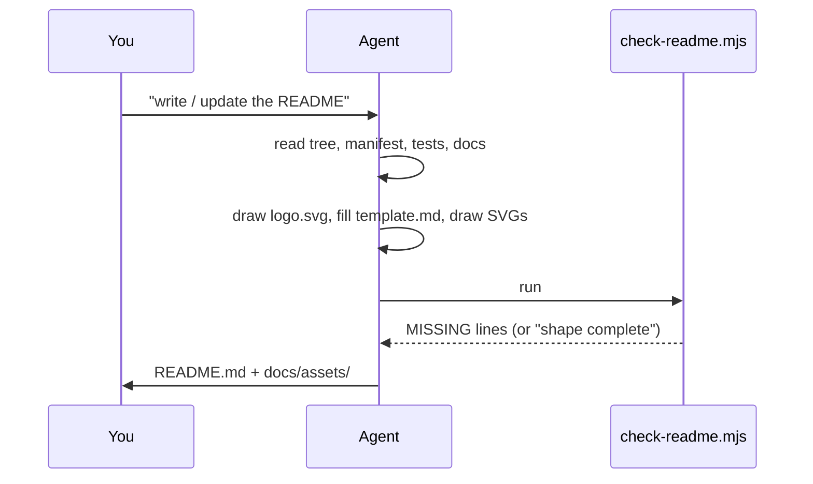

<div align="center">


# readmelyzer

**READMEs people actually enjoy reading.**
Ask your coding agent for a README and get a landing page with its own logo, not a wall of headings.

[](#-quick-start)
[](#-quick-start)
[](#-quick-start)
[](#-verify)
[](LICENSE)

</div>

---

## ⚡ TL;DR

| 🧑 You do | ⚙️ It does | 🎁 You get |
|---|---|---|
| Say *"write a README"* (or *"readmelyzer"*) | Reads the repo, draws a logo and two SVGs, fills a fixed shape, runs a checker | A skimmable landing page where every claim traces to a file |

It works in **Claude Code, Codex CLI and Cursor**. The checker prints one `MISSING:` line per gap until the shape is complete.

<p align="center">
  
</p>

---

## 🤔 Why

Left alone, an agent writes a README that mirrors the file tree. Measured on a small fixture project:

| 🔥 Without the skill | ✅ With the skill |
|---|---|
| Headings copied from folders: Project layout, Getting started, Gates… | A fixed recipe in reading order, TL;DR first |
| 0 badges · no summary · no picture · no FAQ · no license | Logo, badges, two SVGs, FAQ, MIT license |
| Checker: 20 `MISSING:` lines | Checker: passes |

The old version (`writing-readmes`) fixed the structure but still read like a spec sheet. readmelyzer adds a face and a voice: a logo per project, a hook line, an at-a-glance table, callouts and fold-out FAQs.

---

## ✨ Features

- 🎨 **A logo for every project.** `assets/logo.svg.tmpl` has 8 palettes and 7 motifs; each repo gets its own colors and monogram.
- 🪝 **Hook first.** The header leads with the benefit in one bold line, then an at-a-glance *You do · It does · You get* table.
- 🗣️ **A voice guide.** `SKILL.md` has a Do/Don't table: second person, short sentences, terms explained the first time.
- 🖼️ **Visuals that always render.** Hand-written SVGs from `assets/flow.svg.tmpl` and `assets/terminal.svg.tmpl`; Mermaid only as a second diagram.
- 🔎 **A checker that is the definition of done.** `scripts/check-readme.mjs` checks the logo, hook, table, sections, callout, FAQ and paragraph length.
- 📏 **Facts only.** The agent reads the tree, manifest, tests and docs first. No invented numbers.

---

## 🚀 Quick start

```bash
# 1. install (Claude Code)
git clone https://github.com/EranTzarum/readmelyzer.git ~/.claude/skills/readmelyzer

# 2. verify: the checker passes on this repo's own README
node ~/.claude/skills/readmelyzer/scripts/check-readme.mjs ~/.claude/skills/readmelyzer
# README shape complete (logo, 5 badges, 3 images, 10 sections)

# 3. first use: in any repo, ask your agent
#    "write a README for this project"
```

> [!TIP]
> Updating an old README? Say *"update the README"*. Every true fact and link is kept and stale claims are removed. An existing logo is kept unless you ask for a new one.

<details>
<summary><b>Install for Codex CLI and Cursor too</b></summary>

Copy the same folder into each harness's skill root. The folder name must stay `readmelyzer`.

| Harness | Skill root |
|---|---|
| Claude Code | `~/.claude/skills/readmelyzer` |
| Codex CLI | `~/.codex/skills/readmelyzer` |
| Cursor | `~/.cursor/skills/readmelyzer` |

</details>

---

## 🧭 Usage

| You say | What the agent does |
|---|---|
| "write a README" / "readmelyzer" | Reads the repo, draws `docs/assets/logo.svg` and the visuals, writes `README.md`, runs the checker |
| "update / improve / redesign the README" | Keeps every true fact and link, moves them into the recipe, runs the checker |
| "check the README" | Runs `scripts/check-readme.mjs` and reports the `MISSING:` lines |

<p align="center">
  
</p>

```bash
node ~/.claude/skills/readmelyzer/scripts/check-readme.mjs <repo-root> [--file README.md]
```

---

## ⚙️ How it works



1. **A recipe, not a list of don'ts.** Telling an agent which parts the output has, in order, works. Telling it what to avoid does not.
2. **A script owns the structure.** The checker handles the mechanical part, so the agent spends its judgment on the words.
3. **A face for every repo.** Distinct palettes make a workspace of repos recognisable at a glance.

| Part | Takes | Produces |
|---|---|---|
| `SKILL.md` | your request | the recipe, voice guide and rules the agent follows |
| `references/template.md` | — | the skeleton with `{{slots}}` |
| `assets/logo.svg.tmpl` | palette, monogram, motif | `docs/assets/logo.svg` |
| `assets/flow.svg.tmpl`, `assets/terminal.svg.tmpl` | stage names, real output | hero and output SVGs |
| `scripts/check-readme.mjs` | repo root | `MISSING:` lines, or "shape complete" |

---

## 🗂 Repository map

<details>
<summary><b>Show the tree</b></summary>

```
SKILL.md                        recipe, voice guide, rules: what the agent reads
references/template.md          skeleton with {{slots}}
assets/logo.svg.tmpl            logo template: 8 palettes, 7 motifs
assets/flow.svg.tmpl            pipeline hero template
assets/terminal.svg.tmpl        terminal-output template
scripts/check-readme.mjs        structural checker (node, no dependencies)
scripts/check-readme.test.mjs   checker tests (node:test)
agents/openai.yaml              Codex display metadata
docs/assets/                    this README's own logo and images
```

</details>

---

## 🧪 Verify

```bash
node --test scripts/check-readme.test.mjs
node scripts/check-readme.mjs .
```

The tests prove that a complete README passes. They also prove that a missing logo, missing at-a-glance table, missing callout, too few FAQ questions, a long paragraph or filler each get reported. The second command proves this README follows its own recipe.

---

## 🧩 Extend

- **Add a palette or motif:** add a row to the comment block in `assets/logo.svg.tmpl`.
- **Add a required part:** add it to the recipe in `SKILL.md`, the slot in `references/template.md`, a check in `scripts/check-readme.mjs` and a test in `scripts/check-readme.test.mjs`.
- **Add a visual template:** drop `assets/<name>.svg.tmpl` with a comment on how to fill it, and name it in the recipe.

---

## ❓ FAQ

<details><summary><b>Does it overwrite my README?</b></summary>

It rewrites it into the recipe and keeps every true fact and link. The diff shows what moved and what was dropped as stale.
</details>

<details><summary><b>Does it touch code, secrets or git?</b></summary>

No. It writes `README.md`, files under `docs/assets/`, and a `LICENSE` if none exists. Committing is up to you.
</details>

<details><summary><b>What if I already have a logo?</b></summary>

It keeps yours and only draws one when there is none, or when you ask for a redraw.
</details>

<details><summary><b>What if my project has no tests yet?</b></summary>

Verify names the nearest command that passes today and says the real gate can't run yet. No test badge gets invented.
</details>

<details><summary><b>Does it work outside Claude Code?</b></summary>

Yes. Codex CLI and Cursor read the same folder from their own skill roots.
</details>

<details><summary><b>Where did writing-readmes go?</b></summary>

This is the same skill, renamed and redesigned. Requests like "write a README" still trigger it, and GitHub redirects the old repo URL.
</details>

---

## 📄 License

[MIT](LICENSE) © 2026 Eran Tzarum

<div align="center"><sub>Made for repos that deserve a second look.</sub></div>
