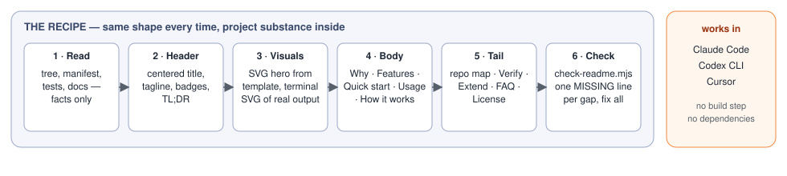
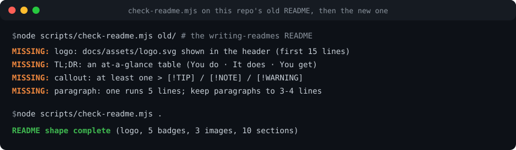
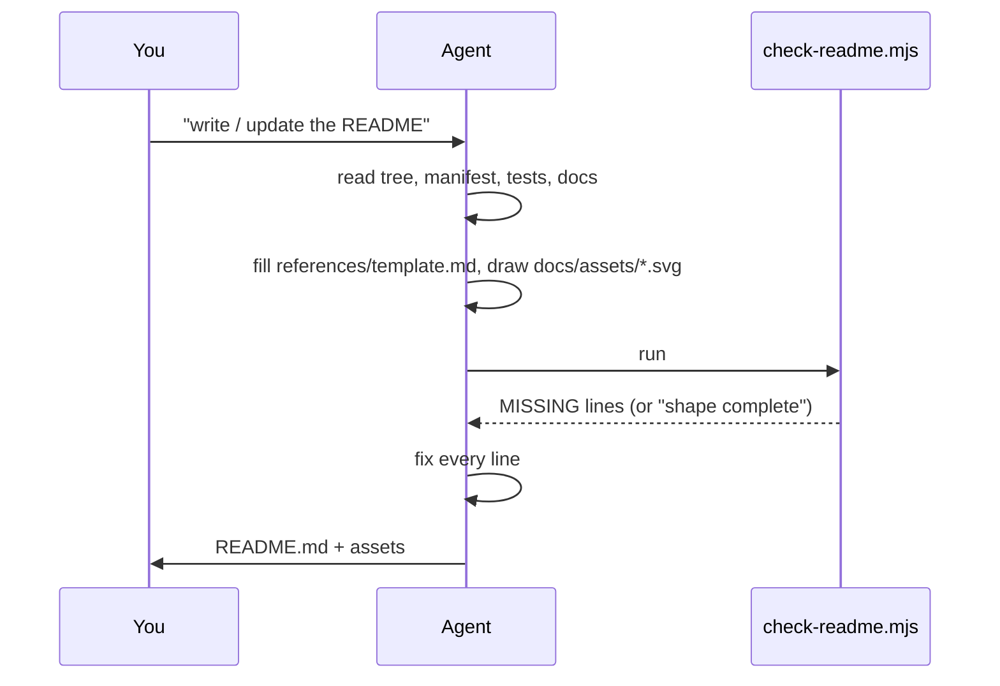

<div align="center">

# 📘 writing-readmes

**A skill that makes AI coding agents write READMEs in one fixed, newcomer-friendly shape.**
Ask Claude Code, Codex or Cursor for a README and get a landing page, not a wall of headings.

[](#quick-start)
[](#quick-start)
[](#quick-start)
[](#quick-start)
[](LICENSE)

</div>

---

## TL;DR

Install this folder into your agent's skill root. From then on, any request like *"write a README"*,
*"update the README"* or *"make the README professional"* triggers the recipe: the agent reads the repo,
fills a **fixed section order** (header + badges, TL;DR, SVG hero, Why, Features, Quick start, Usage,
How it works, repo map, Verify, Extend, FAQ, License), draws the visuals as **hand-written SVGs** from
templates, and runs a **structural checker** that prints one `MISSING:` line per gap until the shape is complete.

<p align="center">
  
</p>

---

## Why

Left alone, an agent writes a README that mirrors the file tree: six plain headings, no summary, no
picture, no install-and-verify, no FAQ, no license. Measured on a small fixture project:

| 🔥 Without the skill | 🕒 With the skill |
|---|---|
| Headings: Project layout, Getting started, Gates, Database, Agent workspace, Documentation map | Fourteen-part recipe in order, TL;DR first |
| Badges 0 · TL;DR no · image no · FAQ no · license no | Badges 4 · two SVGs · FAQ · MIT license |
| Checker: 20 `MISSING:` lines | Checker: passes on the first run |

The shape is not decoration. A newcomer needs, in this order: what it is, what it looks like, why it
exists, how to install and verify, how to use it, how it works, what to do when it goes wrong.

---

## ✨ Features

- **Fixed recipe, fourteen parts** — `SKILL.md` states what the output *is*, in order; sections with nothing true to say are dropped, never padded.
- **Structural checker** — `scripts/check-readme.mjs` verifies header, badges, TL;DR, images that exist on disk, every required section, a verify step, a usage table, bold FAQ questions and a LICENSE link. Exit 1 with one line per gap.
- **SVG templates instead of screenshots** — `assets/flow.svg.tmpl` (pipeline hero) and `assets/terminal.svg.tmpl` (CLI output) render on every host; no rendering tool, no Mermaid-only diagrams.
- **Facts only** — the agent reads the tree, manifest, tests and docs first; every claim traces to a file; no invented numbers.
- **Update mode** — an existing README keeps every true fact and link, gets restructured into the recipe, and loses stale claims.
- **Works in three harnesses** — Claude Code, Codex CLI and Cursor, same folder, no build, no dependencies.

---

## 🚀 Quick start

```bash
# 1. install (Claude Code)
git clone https://github.com/EranTzarum/writing-readmes.git ~/.claude/skills/writing-readmes

# 2. verify — run the checker on this repo's own README
node ~/.claude/skills/writing-readmes/scripts/check-readme.mjs ~/.claude/skills/writing-readmes
# README shape complete (5 badges, 2 images, 10 sections)

# 3. first use — in any repo, inside your agent:
#    "write a README for this project"
```

<details>
<summary><b>Install for Codex CLI and Cursor too</b></summary>

Copy (or clone) the same folder into each harness's user skill root. The folder name must stay `writing-readmes`.

| Harness | Skill root |
|---|---|
| Claude Code | `~/.claude/skills/writing-readmes` |
| Codex CLI | `~/.codex/skills/writing-readmes` |
| Cursor | `~/.cursor/skills/writing-readmes` |

</details>

---

## 🧭 Usage

| You say | What the agent does |
|---|---|
| "write a README" / "create a README" | reads the repo, writes `README.md` from `references/template.md`, draws `docs/assets/*.svg`, runs the checker |
| "update / improve / rewrite the README" | keeps every true fact and link, restructures into the recipe, deletes stale claims, runs the checker |
| "check the README" | runs `scripts/check-readme.mjs` and reports the `MISSING:` lines |

### What the checker prints

<p align="center">
  
</p>

```bash
node ~/.claude/skills/writing-readmes/scripts/check-readme.mjs <repo-root> [--file README.md]
```

---

## ⚙️ How it works



1. **A recipe, not a prohibition list.** Telling an agent "don't write a wall of headings" does not work; telling it exactly which parts the output has, in order, does.
2. **The checker is the definition of done.** Structure is mechanical, so a script owns it; the agent spends its judgment on content.
3. **Visuals that always render.** Two small SVG templates cover a pipeline and a terminal; the agent edits text nodes, nothing else.

| Part | Required? | What it holds |
|---|---|---|
| Centered header + badges | yes | name, tagline, what it does for the reader, 3+ shields.io badges |
| TL;DR | yes | 3–5 sentences: what you run, what happens, what you get |
| Hero visual | yes | one SVG/PNG under `docs/assets/`, in the first 40 lines |
| Why | yes | the problem, as a table when there are several concrete pains |
| Features | yes | bold lead words, one line each, naming the mechanism |
| Quick start | yes | fenced install → verify → first command; `<details>` for other platforms |
| Usage | yes | command table + terminal-style SVG of real output |
| How it works | yes | one Mermaid diagram, 2–4 numbered ideas, a stage/module table |
| What lands in your project / API | conditional | only if the project writes files elsewhere, or is a library |
| Repository map | yes | fenced tree with a comment per line |
| Verify | yes | the command that passes today and what it proves |
| Extend | yes | three bullets naming the file to touch |
| FAQ | yes | 4+ bold questions: overwrite, secrets, existing project, platform |
| License | yes | link to `LICENSE`; MIT added if none exists |

---

## 🗂 Repository map

```
SKILL.md                     the recipe, rules, common mistakes — what the agent reads
references/template.md       the skeleton with {{slots}} the agent fills
assets/flow.svg.tmpl         pipeline / stages hero template
assets/terminal.svg.tmpl     terminal-style output template
scripts/check-readme.mjs     structural checker (node, no dependencies)
agents/openai.yaml           Codex display metadata
docs/assets/                 this README's own images
```

---

## 🧪 Verify

```bash
node scripts/check-readme.mjs .
```

Proves this repo's README follows its own recipe. To test the skill end to end, ask an agent for a README
on any small project without the skill installed, then with it, and run the checker on both: the first
prints a list of `MISSING:` lines, the second prints `README shape complete`.

---

## 🧩 Extend

- **Add a required part** — add it to the numbered recipe in `SKILL.md`, the slot in `references/template.md`, and a check in `scripts/check-readme.mjs`.
- **Add a visual template** — drop a new `assets/<name>.svg.tmpl` with a comment on how to edit it, and name it in recipe part 3.
- **Relax a check for a project type** — make it conditional in `check-readme.mjs` on something observable (a file that exists), not on a phrase in the README.

---

## ❓ FAQ

**Does it overwrite my README?** It rewrites it into the recipe while keeping every true fact and link; the diff shows what moved and what was dropped as stale.

**Does it touch code, secrets, or git?** No. It writes `README.md`, files under `docs/assets/`, and a `LICENSE` if none exists. Committing is yours.

**What if my project has no tests yet?** The Verify section names the nearest command that passes today and says the real gate cannot run yet; no test badge is invented.

**Do I need Mermaid?** No. The hero and the output picture are SVG files that render everywhere; Mermaid appears only as the second diagram in How it works.

**Does it work outside Claude Code?** Yes: Codex CLI and Cursor read the same folder from their own skill roots.

**Can I change the shape?** Yes; the recipe, template and checker are three small files meant to be edited together.

---

## 📄 License

[MIT](LICENSE) © 2026 Eran Tzarum
