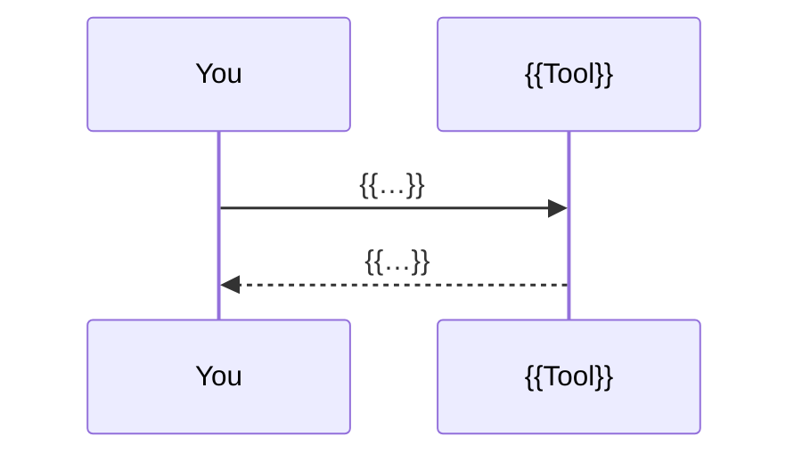

<div align="center">

# {{EMOJI}} {{NAME}}

**{{TAGLINE — what it is, one bold line.}}**
{{SECOND LINE — what it does for the reader, plain words.}}

[](#quick-start)
[](#quick-start)
[](#verify)
[](LICENSE)

</div>

---

## TL;DR

{{3–5 sentences. What you type or run. What happens. What you get. Bold the two or three nouns that matter.}}

<p align="center">
  
</p>

---

## Why

{{One or two sentences of context.}}

| 🔥 What went wrong | 🕒 Found | 💸 Cost |
|---|---|---|
| {{pain}} | {{when}} | {{cost}} |

{{One sentence: how this project answers each row.}}

---

## ✨ Features

- **{{Lead words}}** — {{one line naming the mechanism: file, flag, command}}.
- **{{Lead words}}** — {{…}}.

---

## 🚀 Quick start

```bash
# 1. install
{{install command}}

# 2. verify
{{verify command}}   # {{expected output}}

# 3. first run
{{first command}}
```

<details>
<summary><b>{{Other platforms / harnesses}}</b></summary>

| {{Platform}} | {{Path or command}} |
|---|---|
| {{…}} | {{…}} |

</details>

---

## 🧭 Usage

| Command | What happens |
|---|---|
| `{{cmd}}` | {{…}} |

### {{What the output looks like}}

<p align="center">
  
</p>

```bash
{{the exact command that produced it}}
```

---

## ⚙️ How it works



1. **{{Idea}}** — {{why it matters}}.
2. **{{Idea}}** — {{…}}.

| # | {{Stage / Module}} | Takes | Produces |
|---|---|---|---|
| 0 | **{{…}}** | {{…}} | `{{file}}` |

---

## 🗂 What lands in your project

```
{{path}}              {{what it is, in a few words}}
```

---

## 🗂 Repository map

```
{{file}}              {{purpose}}
```

---

## 🧪 Verify

```bash
{{test command}}
```

{{One or two sentences: what the test proves.}}

---

## 🧩 Extend

- **{{Add X}}** — {{file to touch}}.
- **{{Add Y}}** — {{…}}.
- **{{Add Z}}** — {{…}}.

---

## ❓ FAQ

**Does it overwrite my files?** {{…}}

**Does it touch secrets / commit / deploy?** {{…}}

**What if I already have {{…}}?** {{…}}

**{{Platform question}}?** {{…}}

---

## 📄 License

[MIT](LICENSE) © {{year}} {{owner}}
