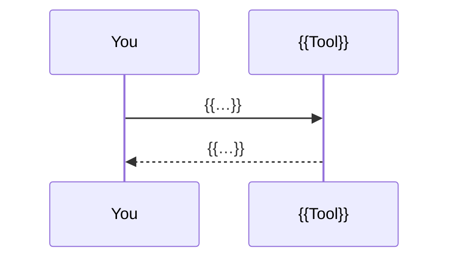

<div align="center">


# {{NAME}}

**{{HOOK — the benefit in one bold line, e.g. "Long prompts in, finished work out."}}**
{{ONE PLAIN LINE — what the reader gets, in words a newcomer knows.}}

[](#-quick-start)
[](#-verify)
[](LICENSE)

</div>

---

## ⚡ TL;DR

| 🧑 You do | ⚙️ It does | 🎁 You get |
|---|---|---|
| {{the one command or action}} | {{what happens, in one line}} | {{the outcome you can see}} |

{{At most two sentences of context. Bold the two nouns that matter.}}

<p align="center">
  
</p>

---

## 🤔 Why

{{One sentence: the situation before this project existed.}}

| 🔥 What went wrong | 📍 Where | 💸 Cost |
|---|---|---|
| {{real pain}} | {{project / date}} | {{what it cost}} |

{{One sentence: how this project answers each row.}}

---

## ✨ Features

- 🧩 **{{Lead words.}}** {{one line naming the mechanism: file, flag, command}}.
- 🛡️ **{{Lead words.}}** {{…}}.

---

## 🚀 Quick start

```bash
# 1. install
{{install command}}

# 2. verify
{{verify command}}   # {{expected output}}

# 3. first run
{{first command}}
```

> [!TIP]
> {{The shortcut or gotcha people miss on day one.}}

<details>
<summary><b>{{Other platforms / harnesses}}</b></summary>

| {{Platform}} | {{Path or command}} |
|---|---|
| {{…}} | {{…}} |

</details>

---

## 🧭 Usage

| Command | What happens |
|---|---|
| `{{cmd}}` | {{…}} |

<p align="center">
  
</p>

```bash
{{the exact command that produced it}}
```

---

## ⚙️ How it works



1. **{{Idea.}}** {{why it matters}}.
2. **{{Idea.}}** {{…}}.

| Part | Takes | Produces |
|---|---|---|
| `{{file}}` | {{…}} | {{…}} |

---

## 📦 What lands in your project

```
{{path}}              {{what it is, in a few words}}
```

---

## 🗂 Repository map

<details>
<summary><b>Show the tree</b></summary>

```
{{file}}              {{purpose}}
```

</details>

---

## 🧪 Verify

```bash
{{test command}}
```

{{One or two sentences: what passing proves.}}

---

## 🧩 Extend

- **{{Add X}}** — {{file to touch}}.
- **{{Add Y}}** — {{…}}.
- **{{Add Z}}** — {{…}}.

---

## ❓ FAQ

<details><summary><b>Does it overwrite my files?</b></summary>

{{one-line answer}}
</details>

<details><summary><b>Does it touch secrets, commit or deploy?</b></summary>

{{…}}
</details>

<details><summary><b>What if I already have {{…}}?</b></summary>

{{…}}
</details>

<details><summary><b>{{Platform question}}?</b></summary>

{{…}}
</details>

---

## 📄 License

[MIT](LICENSE) © {{year}} {{owner}}

<div align="center"><sub>{{one warm closing line, e.g. "Made for agents that should finish what they start."}}</sub></div>
